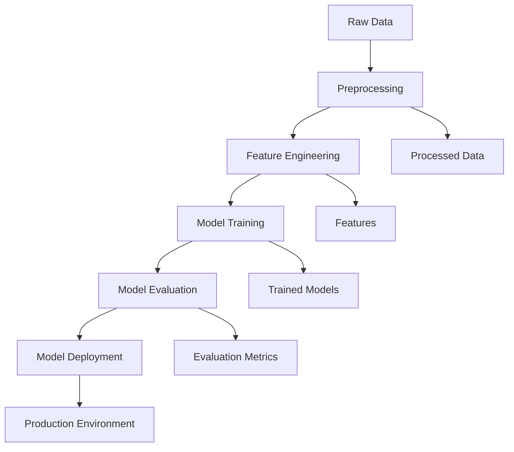
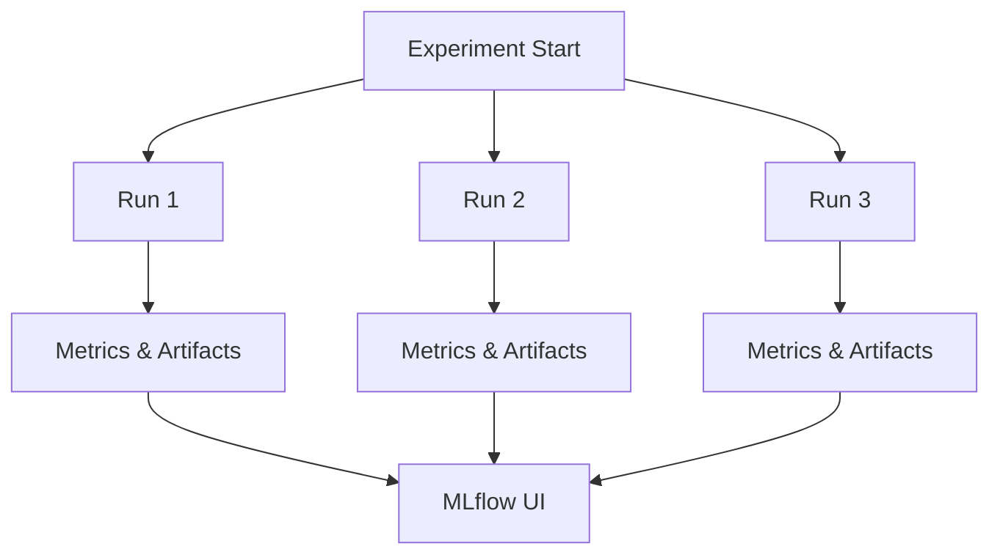

# Zomato Price Prediction using MLFLOW

This project aims to predict restaurant prices using various machine learning techniques. The entire process is tracked and managed using MLflow, a powerful tool for the complete machine learning lifecycle.

## Table of Contents
- [Introduction](#introduction)
- [Features](#features)
- [Installation](#installation)
- [Usage](#usage)
- [Project Structure](#project-structure)
- [Diagrams](#diagrams)
- [Contributing](#contributing)
- [License](#license)

## Introduction

This repository contains code and resources to predict the prices of restaurants listed on Zomato. We utilize MLflow to manage and track our machine learning experiments, making the process of model training, evaluation, and deployment seamless.

## Features

- **Data Preprocessing**: Cleaning and preparing Zomato data for modeling.
- **Feature Engineering**: Creating meaningful features from raw data.
- **Model Training**: Implementing various machine learning models.
- **Model Evaluation**: Assessing model performance.
- **MLflow Tracking**: Recording and visualizing experiments.

## Installation

To get started with this project, follow these steps:

1. Clone the repository:
   ```bash
   git clone https://github.com/yourusername/zomato-price-prediction.git
   cd zomato-price-prediction
   ```

2. Create a virtual environment and activate it:
   ```bash
   python3 -m venv venv
   source venv/bin/activate
   ```

3. Install the required packages:
   ```bash
   pip install -r requirements.txt
   ```

4. Install and configure MLflow:
   ```bash
   pip install mlflow
   ```

## Usage

To run the project, use the following commands:

1. **Preprocess the Data**:
   ```bash
   python src/preprocess.py
   ```

2. **Train the Model**:
   ```bash
   python src/train.py
   ```

3. **Run MLflow UI**:
   ```bash
   mlflow ui
   ```
   Access the MLflow UI at [http://localhost:5000](http://localhost:5000).

## Project Structure

```
.
├── README.md
├── data
│   ├── raw
│   └── processed
├── notebooks
├── src
│   ├── preprocess.py
│   ├── train.py
│   └── utils.py
├── models
├── mlruns
├── requirements.txt
└── setup.py
```

- **data**: Contains raw and processed data.
- **notebooks**: Jupyter notebooks for exploratory data analysis (EDA) and prototyping.
- **src**: Source code for data preprocessing, training, and utility functions.
- **models**: Saved models.
- **mlruns**: MLflow tracking data.
- **requirements.txt**: List of dependencies.
- **setup.py**: Script for setting up the project.

## Diagrams

### Project Workflow



### MLflow Tracking



## Contributing

Contributions are welcome! Please read our [Contributing Guide](CONTRIBUTING.md) for more information.

## License

This project is licensed under the MIT License. See the [LICENSE](LICENSE) file for details.

---

Feel free to reach out if you have any questions or need further assistance!

Happy Coding! 🚀